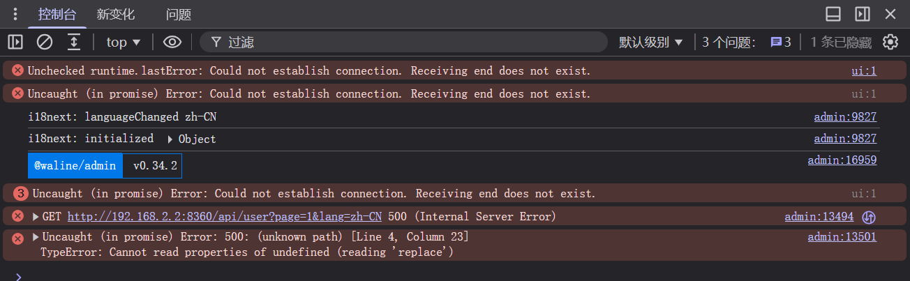

## 前言
前几天登录博客的评论系统waline，发现用户列表加载不出来，打开网络调试器发现请求接口返回500，一直是以为我数据库出错了，连续换了几个类型的数据库（MongoDB,SQLite,PostgreSQL），后来又尝试换了部署平台从Vercel换到了Netlify，所有情况都试遍了，仍然加载不出用户列表。


## 排查
尝试了众多方法无果之后，我在想是不是waline server端的代码本身出了问题，于是就去翻看了一下他们官方的[源代码](https://github.com/walinejs/waline/blob/main/packages/server/src/controller/user.js)，打开 `packages/server/src/controller/user.js`，定位到用户列表接口 `getAction` 里生成头像的这一行：
 
```js
user.avatar ||= await think.service('avatar').stringify(user);
```
 
再看 `avatar` 服务内部的模板：
 
```js

  ...{{mail|replace('@qq.com', '')}}...

  https://seccdn.libravatar.org/avatar/{{mail | trim | lower | md5}}

```
 
模板取的是 `mail` 字段，但 `user` 表里邮箱字段叫 `email`，不叫 `mail`。直接把 `user` 对象传进去，模板里 `mail` 是 `undefined`，执行 `mail|replace(...)` 时报错：
 
```
TypeError: Cannot read properties of undefined (reading 'replace')
```
 
跟控制台报错完全对上。跟数据库类型、部署平台没有任何关系。
 
## 定位根因
 
全局搜了一下项目里所有调用 `avatar` 服务的地方，发现 `token.js`（登录）和 `base.js`（评论列表）在处理同一张 `user` 表时，都做了字段映射：
 
```js
await think.service('avatar').stringify({
  mail: user.email,
  nick: user.display_name,
  link: user.url,
});
```
 
只有 `user.js` 这一处漏了映射，直接传了原始对象。是官方代码里孤立的一处遗漏。
 
## 修复
 
把 `user.js` 改成和另外两处一致的写法：
 
```js
user.avatar ||= await think.service('avatar').stringify({
  mail: user.email,
  nick: user.display_name,
  link: user.url,
});
```
 
重新部署waline服务，用户列表恢复正常。

## 小结
最后改完之后也是把修复补丁重新[pr](https://github.com/walinejs/waline/pull/3816)回上游了。
